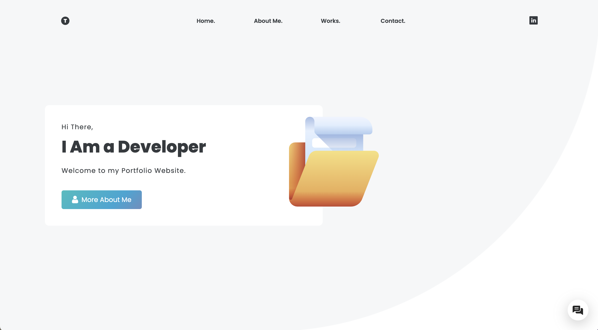
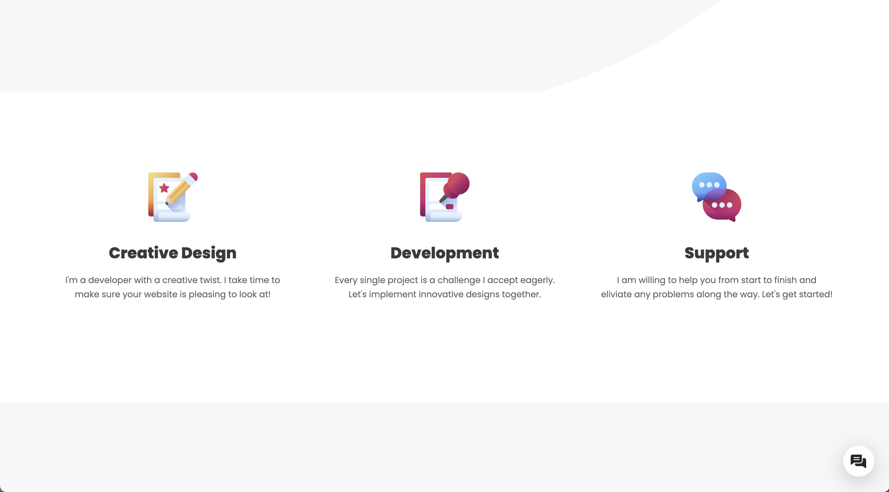
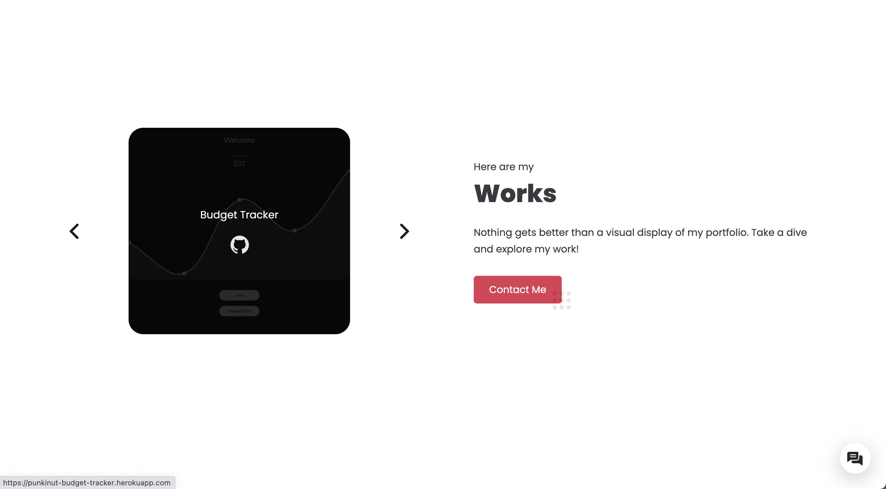

# React Portfolio

## Deployment

My Portfolio has been deployed here:
[Portfolio](https://punkinut.github.io/React-Portfolio/)

## Why make this?

My goal was to make a rebuild of my online portfolio built with React 🚀. I also wanted to experiment with some front end libraries to enhance the UI!

## My goal

I decided to follow my design instincts and went for something modern and sleek. I wanted to have a combination of flex and interesting grid layouts. I also wanted to experiment with absoloute positioning in order to add elements around the page. I also added animation libraries to make to page feel more alive.

## Landing Page

## Services Page

## Works Page

## End note

I hope you enjoyed going through my webpage :)
